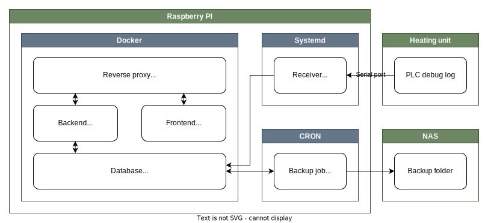
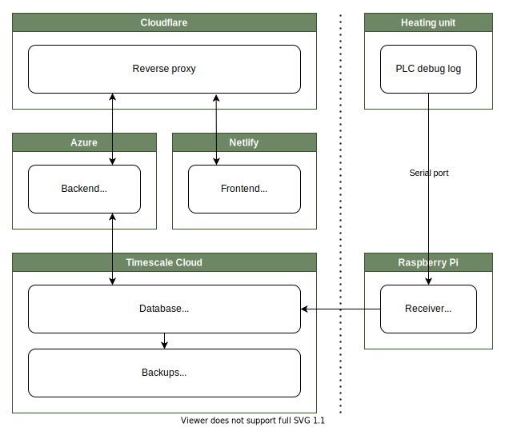

# Summary

Heating-data-monitor is the creative name of the monitoring system I built for our heating unit. It consists of a database, a receiving/parsing application, a real-time web application, some scripts, sarcastic documentation and more.

This is the first web application I have ever worked on and it has given me some wonderful as well as some dreadful first experiences. To pay homage to the impact this project has had on me and how it shaped my path as a programmer, I wrote down some words in the section [journey](#Journey).

# Goals

As long as I have ideas for cool new features I will keep on expanding and rebuilding parts of this system. The following are my current ideas and goals.

- [x] Real time dashboard with the current state of the heating unit
- [x] Real time graph to visualize recent changes in detail
- [x] History graph to visualize the state's development during any time period in the past
- [ ] Forecast graph to visualize predicted temperature development in the near future
- [ ] Forecast predictions on the dashboard e.g. "Boiler temperature will fall below 40° C in 9 hours"
- [ ] Push notifications for relevant events and infos

In addition to that I have a few meta-goals for the whole project:

- Learning effect & fun have priority over outcome & reason
- Clean code, coherent documentation, and a tablespoon of sarcasm are a must, as this is _the_ project I like to show to others
- Think bigger than one Raspberry Pi but keep an eye on the over-engineering-enthusiasm
- Plan and document new features, ideas, etc. and use GitHub's tools like the Kanban boards

# Demo

The interface isn't the prettiest but it gets the job done :)

# Architecture & deployment overview

This diagram shows the general architecture of the system with the respective communication channels and deployment locations. The live system is running on a single Raspberry Pi architecture like this, making it the primary guideline for related design decisions. \
The documentation for deploying the system to an architecture like this can be found in [SETUP.md](./SETUP.md).

Still, I have tried to build this system in a way that would allow for a more sophisticated deployment architecture with different servers all over the internet (this relates to the third meta-goal I listed). Below you can see an example of an architecture that I believe should work with this system with very little code changes required. The two sides separated by the dotted line symbolize third party internet hosting providers and the intranet at our house respectively. Everything on the left side symbolizes a general idea, with things like load-balancing accounted for but not illustrated directly. It should be noted that I don't have much experience with third party providers nor am I interested in setting up the deployment pipeline and everything else required for an architecture like this. It's mainly an idea intended to drive me to write modular and portable code as well as to showcase my knowledge and depth of thought put into the project.

# Tech stack

The database is [TimescaleDB](https://www.timescale.com/), a time-series extension for [PostgreSQL](https://www.postgresql.org/).  
All of the backend is written with C# and .NET. The API uses [ASP.NET Core](https://docs.microsoft.com/en-us/aspnet/core) and [SignalR](https://docs.microsoft.com/en-us/aspnet/core/signalr/introduction) for real-time communication.  
Interactions with the database are implemented with [Dapper](https://dapperlib.github.io/Dapper/) and SQL.  
The user interface is currently built with [Angular](https://angular.io/) and TypeScript.  
The charting library currently in use is [μPlot](https://leeoniya.github.io/uPlot/).  
The system is running on a [Raspberry Pi](https://www.raspberrypi.org/), some parts behind [Docker](https://www.docker.com/), others just with systemd.  
Network traffic is proxied with [NGINX](https://nginx.org/) and secured with Uncomplicated Firewall (UFW).  
The Raspberry Pi is connected to the heating unit via [RS232](https://en.wikipedia.org/wiki/RS-232).

### Used previously

- [SQLite](https://sqlite.org) (database)
- [Entity Framework Core](https://docs.microsoft.com/en-us/ef/core/) (ORM)
- [Blazor Server](https://docs.microsoft.com/en-us/aspnet/core/blazor/) (frontend + server-client communication)
- [Chart.js](https://www.chartjs.org/) (charting library)
- [ChartJs.Blazor](https://github.com/mariusmuntean/ChartJs.Blazor) (Chart.js Blazor integration)

# Journey

This project was my first "real" project and introduction into web dev including frameworks, databases, ORMs, charting libraries, hosting and proxying, git, GitHub and much more. I wanted to create something that had an actual use and luckily I was just given the opportunity to interface our heating unit via serial port.
I chose my favourite language C# and got to work. But for creating a web site you need more than that and coincidentally there was this shiny new framework called "Blazor" that promised you wouldn't need to write JavaScript and it had just recently launched in beta. \
In addition to being new and cool, it had the great benefit of blending frontend and backend. You see, Blazor server allows you to write and execute all your frontend code on the backend by propagating all the UI changes to the clients via SignalR.
Of course there are some obvious downsides to an always-connected web-socket connection from every client to the server but it allowed me to directly hook UI updates to the serial port parser with no communication hurdle in between, absolute madness now that I think about it. \
In hindsight, Blazor definitely slowed down my progress in understanding web dev because I couldn't even really explain the difference between a frontend and a backend, it just all magically worked and synced in real-time. On the other hand, I would have needed much more time to build a prototype if I had had to learn another language and worry about all the communication between server and client. \
After a while I wanted to implement a history view with a cute graph. I searched the web and found ChartJs.Blazor, a Blazor integration of Chart.js. Unfortunately for me, the project had been abandoned by Marius and left in a state that didn't work for the latest preview version of Blazor. So being the good programmer I was, I forked the project and.. no wait, I copied all the code in a new repo (what is forking anyway that sounds weird), and started to update and refactor the library. After two weeks it was ready and working again so I added it to my web site and built my first graph. In the meantime I had learned a lot about .NET libraries and NuGet, and my interest in keeping the project alive grew rapidly. \
Another user, @SeppPenner, showed their interest and dedication and with their help I reworked the library, added tons of features, released updates and built a community.
After a few months, I decided to contact Marius with the hope that he'd help us merge back the changes I was so proud of and release them as an "official" update. Fortunately, he decided to revive his project and merged all my code back to his project (including the commit history which is awesome) and updated the official ChartJs.Blazor package with a 1.0 release (big mistake in hindsight). More background on the fusion [here](https://github.com/Joelius300/ChartJSBlazor/issues/97). \
Together with Marius I kept expanding and fixing the library until the end of 2019 when he apparently decided to move away from the project again only sporadically returning for a change or two in mid 2020. I kept on maintaining the library and community until the beginning of 2021 when I finally decided to officially step away. More insight on my goodbye [here](https://github.com/mariusmuntean/ChartJs.Blazor/issues/160). \
Coming back to the project at hand, I had removed ChartJs.Blazor and Blazor alltogether in my first big rework during the 2020 lockdown. I switched to PostgreSQL (from SQLite), to Angular (from Blazor) and to uPlot (from ChartJs.Blazor). You can check out the state just before the first big rework with the [v0 tag](https://github.com/Joelius300/HeatingDataMonitor/tree/v0). \
Now it's mid 2022 and I am working on [another big rework](https://github.com/Joelius300/HeatingDataMonitor/projects/2?query=is%3Aopen+sort%3Aupdated-desc), this time to restructure the backend and database architecture as well as the deployment by moving towards Docker. The state before this second rework can be found under the [v1 tag](https://github.com/Joelius300/HeatingDataMonitor/tree/v1).  
Update 2022-09-02: I have finished the architectural rework ([v2](https://github.com/Joelius300/HeatingDataMonitor/tree/v2)) and will now move on to AI or UI stuff.

There may be more but these are the most notable things in the history of this project; To be continued.

# Licenses

This project is licensed under the [GNU Affero General Public License Version 3](https://www.gnu.org/licenses/agpl-3.0.en.html). This applies to every file within this repository unless there is a license notice at the top of the file that says otherwise.  
If you have any questions about this or would like to use a specific part under a different license, please open an issue and I will try my best to assist.
