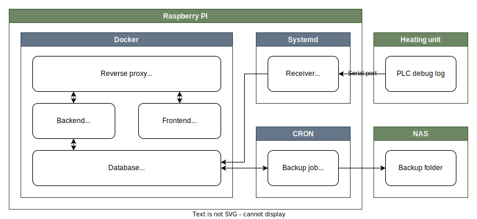

# Summary
Heating-data-monitor is the creative name of the monitoring system I built for our heating unit. It consists of a database, a receiving/parsing application, a real-time web application, some scripts, sarcastic documentation and more.

This is the first web application I have ever worked on and it has given me some wonderful as well as some dreadful first experiences. To pay homage to the immense impact this project has had on me and how it shaped my path as a programmer, I _will_ write down some words on it's journey **TODO** :)

# Goals
As long as I have ideas for cool new features I will keep on expanding and rebuilding parts of this system. The following are my current ideas and goals.

- [x] Real time dashboard with the current state of the heating unit
- [x] Real time graph to visualize recent changes in detail
- [x] History graph to visualize the state's development during any time period in the past
- [ ] Forecast graph to visualize predicted temperature development in the near future
- [ ] Forecast predictions on the dashboard e.g. "Boiler temperature will fall below 40° C in 9 hours"
- [ ] Push notifications for relevant events and infos

In addition to that I have a few meta-goals for the whole project:
- Learning effect & fun have priority over outcome & reason
- Clean code, coherent documentation, and a tablespoon of sarcasm are a must, as this is _the_ project I like to show to others
- Think bigger than one Raspberry Pi but keep an eye on the over-engineering-enthusiasm
- Plan and document new features, ideas, etc. and use GitHub's tools like the Kanban boards

# Demo
The interface isn't the prettiest but it gets the job done :)

# Architecture & deployment overview

TODO Much more complex architecture that should be possible as well as a design goal

# Tech stack
The database is [TimescaleDB](https://www.timescale.com/), a time-series extension for [PostgreSQL](https://www.postgresql.org/).  
All of the backend is written with C# and .NET. The API uses [ASP.NET Core](https://docs.microsoft.com/en-us/aspnet/core) and [SignalR](https://docs.microsoft.com/en-us/aspnet/core/signalr/introduction) for real-time communication.  
Interactions with the database are implemented with [Dapper](https://dapperlib.github.io/Dapper/) and SQL.  
The user interface is currently built with [Angular](https://angular.io/) and TypeScript.  
The charting library currently in use is [μPlot](https://leeoniya.github.io/uPlot/).  
The system is running on a [Raspberry Pi](https://www.raspberrypi.org/), some parts behind [Docker](https://www.docker.com/), others just with systemd.  
Network traffic is proxied with [NGINX](https://nginx.org/) and secured with Uncomplicated Firewall (UFW).  
The Raspberry Pi is connected to the heating unit via [RS232](https://en.wikipedia.org/wiki/RS-232).

### Used previously
- [SQLite](https://sqlite.org) (database)
- [Entity Framework Core](https://docs.microsoft.com/en-us/ef/core/) (ORM)
- [Blazor Server](https://docs.microsoft.com/en-us/aspnet/core/blazor/) (frontend & server-client communication)
- [Chart.js](https://www.chartjs.org/) (charting library)
- [ChartJs.Blazor](https://github.com/mariusmuntean/ChartJs.Blazor) (Chart.js Blazor integration)

# Journey
TODO

# Credits / Licenses
This project is licensed under the [GNU Affero General Public License Version 3](https://www.gnu.org/licenses/agpl-3.0.en.html). This applies to every file within this repository unless there is a license notice at the top of the file that says otherwise.  
If you have any questions about this or would like to use a specific part under a different license, please open an issue and I will try my best to assist.
