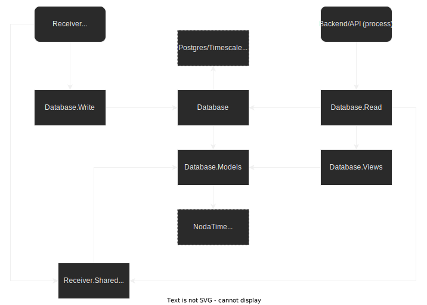

# HeatingDataMonitor Backend

TODO:
- (Of course update this and the other readmes when we're done)

### New database stuff:
- Used timescaledb inside a docker container
- Used updated dbCreate.sql script
  - Everything snake_case
  - No more id field
  - Create hypertable on received_time (we don't really care about sps_time)
  - No more index with included columns
- Imported old data by using csv export command (see history on raspberry pi), then dropping the first column in vs code, then importing with `\copy heating_data from mycsv.csv DELIMITER ',' CSV HEADER`

### Create new db and migrate old data
- Export current data as CSV (only the rows we need) by executing this on the RP: `psql -d "HeatingDataMonitor" -h localhost -U heatingDataMonitorUser -c "\copy \"HeatingData\" (\"SPS_Zeit\",\"ReceivedTime\",\"Kessel\",\"Ruecklauf\",\"Abgas\",\"CO2_Soll\",\"CO2_Ist\",\"Saugzug_Ist\",\"Puffer_Oben\",\"Puffer_Unten\",\"Platine\",\"Betriebsphase_Kessel\",\"Aussen\",\"Vorlauf_HK1_Ist\",\"Vorlauf_HK1_Soll\",\"Betriebsphase_HK1\",\"Vorlauf_HK2_Ist\",\"Vorlauf_HK2_Soll\",\"Betriebsphase_HK2\",\"Boiler_1\",\"DI_0\",\"DI_1\",\"DI_2\",\"DI_3\",\"A_W_0\",\"A_W_1\",\"A_W_2\",\"A_W_3\",\"A_EA_0\",\"A_EA_1\",\"A_EA_2\",\"A_EA_3\",\"A_EA_4\",\"A_PHASE_0\",\"A_PHASE_1\",\"A_PHASE_2\",\"A_PHASE_3\",\"A_PHASE_4\") TO '/mnt/data_backups/$(date +%Y-%m-%dT%H_%M_%S%z).csv' DELIMITER ',' CSV HEADER;"`
- create timescaledb container: `docker run -d -name timescaledb -p 127.0.0.1:5432:5432 -e POSTGRES_PASSWORD=password timescale/timescaledb:latest-pg14`
- psql in container (either use psql directly or (if there's newer version in the container use docker exec)): `docker exec -it timescaledb psql -U postgres `
- `CREATE DATABASE heating_data_monitor;`
- `\c heating_data_monitor`
- Execute SQL script in dbCreate.sql
- `SET TimeZone='UTC';`
- Import latest CSV backup with: `\copy heating_data from mycsv.csv DELIMITER ',' CSV HEADER` (make sure you can access the file from where you're executing; it's easiest to use `psql` from your PC instead of executing it in docker for this step)
- Reset TimeZone: `SET TimeZone='Europe/Zurich';`
- Check if import worked correctly (`select sps_zeit, received_time from heating_data LIMIT 10;`)


### Setup for testing serial port receiver
I did this today 08.02.22 and everything seems to work. I will continue with the parser and then db-insertion, which can luckily both be tested completely without a serial port.

- Install Raspberry PI OS Lite 64-bit
- `sudo apt update && sudo apt upgrade`
- `sudo raspi-config`
  - Interfacing Options -> Serial
    - Login Shell: No
    - Enable hardware: Yes
- Reboot
- Edit `/boot/config.txt` and add `dtoverlay=disable-bt
- Configure minicom with `sudo minicom -s` (don't forget to save)
  - Device: `/dev/ttyAMA0`
  - Speed: 9600
  - Parity: None
  - Data: 8
  - Stopbits: 1
  - (you need to configure minicom the same way on the host pc obviously, also for my Manjaro PC I needed "Hardware Flow Control" disabled)
- Now you can open minicom on both raspi and host and see if you receive the data correctly.
- Next, use the receiver to check if everything works
  - Add tons of logging statements to the SerialPortCsvHeatingDataReceiver
  - Use a simple test-worker, which uses an await foreach and just logs each line it gets
  - Install .NET on raspi (https://docs.microsoft.com/en-us/dotnet/iot/deployment)
  - Copy necessary source files over and adjust some csproj stuff
  - Use `dotnet run` to run the reading loop
  - Use minicom on the host to send data. IMPORTANT: Dont use Enter, it sends a CR (\r), not a LF (\n). To send a newline, you need to use Ctrl+j (at least on my system).
  - After that works correctly, use `echo -n "blabla\nblabla" > /dev/ttyS0` and similar to ensure receiving junks of data, potentially including line-breaks works correctly
  - TODO document/archive Using the testing code from the TestingGrounds, run through it with the actual serial port and minicom


### New architecture


## Docker containers
The application backend (API), the database and the reverse proxy (which also serves the static frontend) run in Docker containers. They need to be able to communicate: Reverse proxy for forwarding the requests and the API for connecting to the database. The database also needs to be exposed outside of the docker network so the receiver process (which isn't running in docker) can connect to it. For this reason and because I want the database to be isolated from the web application and my tinkering with it, I avoided docker-compose for the database. This should also help ensuring the data-collection runs as uninterrupted as possible. The web app on the other hand uses docker-compose for quick installation and updates.

TODO: I mean that's an idea _but_ it's probably cleaner to only use one thing, in this case docker-compose and make use of the [service profiles](https://docs.docker.com/compose/profiles/) if that's handy or [multiple compose files](https://stackoverflow.com/questions/63051200/how-to-docker-compose-up-only-for-services)

TODO: This section should probably go in the main readme. Also what is our goal? is it automatic updates? is it faster deployment? Right know I don't think automatic updates are worth it. Instead I'd like to aim for the following: Cloning the repo, installing some dependencies, editing the docker-compose.yml and install-script for some variables, running said install-script which installs the receiver, adds and enables it as a service and adds the backup-cron-job, and finally running `docker-compose up -d`. Then updates can be done by pulling the repo and running `docker-compose down` and up -d again. The backup jobs and receiver would have to be updated manually unless the install script can handle that but I don't think that's necessary.

### API container
Build:

From /backend folder
```bash
docker build -t joelius300/heatingdatamonitor-api:latest -f HeatingDataMonitor.API/Dockerfile .
```

### Reverse-proxy including frontend
Build:

From /frontend folder
```bash
docker build -t joelius300/heatingdatamonitor-frontend-server:latest .
```

-- old stuff


The backend itself is split into two parts.
One part contains the models, the logic for retrieving data from the heating unit and the database context for the history aspect.
The other part contains the actual API logic including handling background processes, responding to http requests, opening a SignalR-Hub for real-time communication and actually using the provided database context with a specific implementation (here PostgreSQL).

The solution also contains two standalone applications:
- One is an application which allows me to easily migrate the archived data from the old system to the new system by converting the datetime values.
- The other one acts as a fake heating unit which periodically sends data to a specified serial port. This allows for more elaborate testing and debugging without having to reinvent the wheel for testing (as there are no abstractions to `SerialPort`).

## Debugging
As mentioned above, there's a fake heating unit which can be used for debugging very close to the actual use case. If you don't need that, just start the application in development mode which will automatically use a fake receiver which just reads from a file.

In development mode, the CORS policy is relaxed for `localhost:4200` where the angular dev server runs so the SignalR connection still works even when back- and frontend are hosted separately.

### Start backend in dev mode from CLI
`env ASPNETCORE_ENVIRONMENT=Development ./HeatingDataMonitor`

## Deploy
- `dotnet publish -c Release -r linux-arm`
- Copy `bin\Release\netcoreapp3.1\linux-arm\publish` to `/home/pi/HeatingDataMonitor`
- `chmod +x /home/pi/HeatingDataMonitor/HeatingDataMonitor`

## PostgreSQL
### Setup
- `sudo apt install postgresql postgresql-client` (Note, this might not be the latest major but that's fine)
- Change user for first connect: `sudo su postgres`
- `psql`
- Do everything in `dbCreate.sql` (there are multiple ways of doing so)
- For connecting later on: `psql -U heatingDataMonitorUser -h 127.0.0.1 HeatingDataMonitor`

### Adjusting the sequence after importing old data
This is necessary depending on how you import the data. Otherwise the sequence might generate already existing ids.
Note the double quotes in single quotes, those are very important for the case sensitivity of PostgreSQL.

`SELECT setval('"HeatingData_Id_seq"', WhateverIdTheLatestRowHas);`

## Systemd service
### Add and register
- `sudo nano /etc/systemd/system/heating-data-monitor.service`
- Paste
  ```
  [Unit]
  Description=Heating Data Monitor Backend running on .NET Core

  [Service]
  WorkingDirectory=/home/pi/HeatingDataMonitor
  ExecStart=/home/pi/HeatingDataMonitor/HeatingDataMonitor
  Restart=always
  # Restart service after 10 seconds if the dotnet service crashes:
  RestartSec=10
  KillSignal=SIGINT
  SyslogIdentifier=heating-data-monitor
  User=pi
  Environment=ASPNETCORE_ENVIRONMENT=Production
  Environment=DOTNET_PRINT_TELEMETRY_MESSAGE=false

  [Install]
  WantedBy=multi-user.target
  ```
- `sudo systemctl enable heating-data-monitor`

### Manage
- `sudo systemctl start heating-data-monitor`
- `sudo systemctl stop heating-data-monitor`
- `sudo systemctl status heating-data-monitor`
- `sudo journalctl -fu heating-data-monitor`

